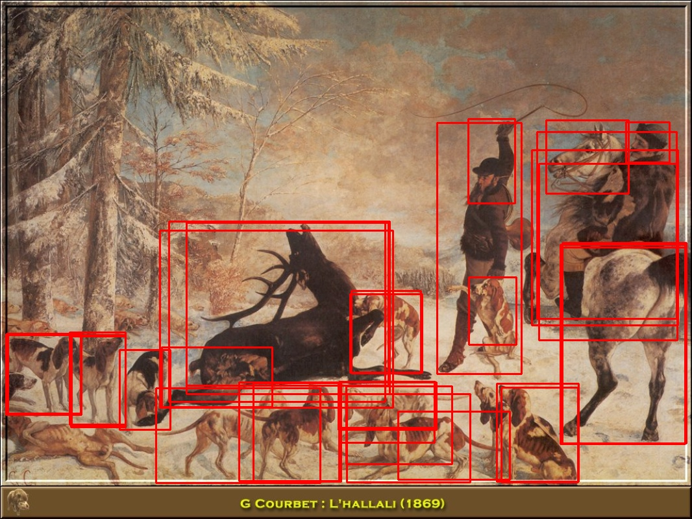
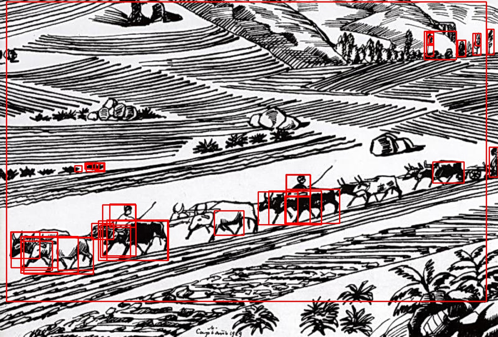
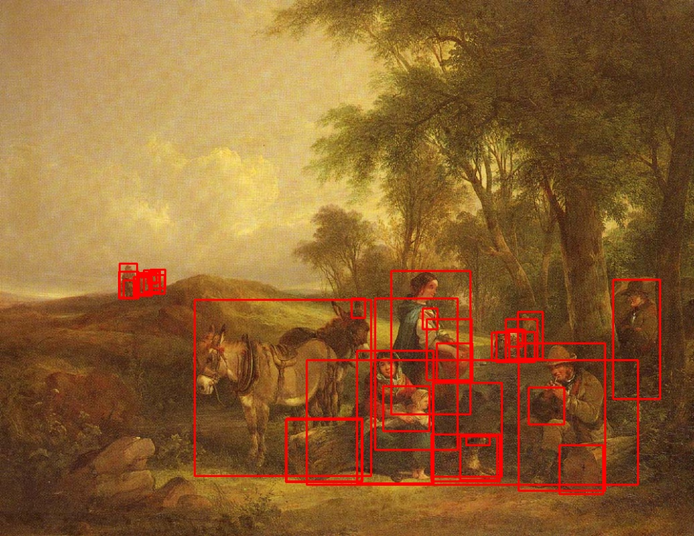
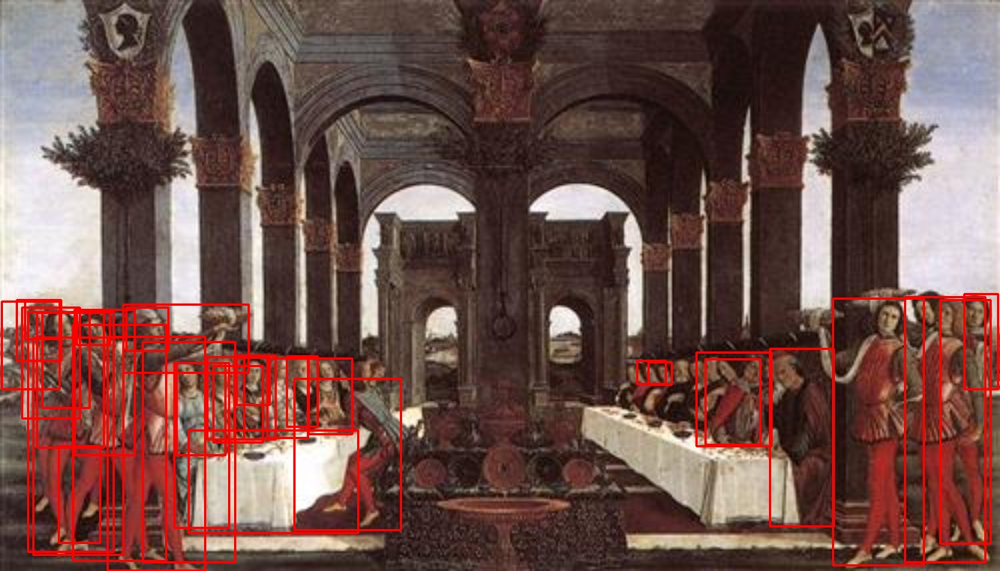

# bottom-up-features
This repo covers the implementation of extracting features for training caption models (e.g., [Meshed-Memory-Transformer](https://github.com/aimagelab/meshed-memory-transformer)). The features are extracted by a pre-trained ResNet101-faster-RCNN. It selects top 36 detections per image and each detection has a feature of dimension 2048. Thus, for each image, the feature is a tensor of dimension 36x2048.

This repo is an example of preparing features for training on [ArtEmis](https://github.com/Kilichbek/artemis-speaker-tools-b) dataset. The images of WikiArt can be downloaded from [here](https://github.com/cs-chan/ArtGAN/tree/master/WikiArt%20Dataset).

Some example of detections are illustrated below.







## Requirements
We tested on a Nvidia RTX-A6000 with pytorch-1.10, cuda-11.3.
```shell
# install pytorch
conda install pytorch torchvision torchaudio cudatoolkit=11.3 -c pytorch

# install Detectron2
python -m pip install detectron2 -f \
  https://dl.fbaipublicfiles.com/detectron2/wheels/cu113/torch1.10/index.html
```

## Extract features
If you have a single GPU on the system, simply do:
```shell
python generate_tsv.py
```
If you have multiple GPUs (for example, 4 GPUs):
```shell
python generate_tsv_by_gpu.py --num_gpus=4 --gpu=[0|1|2|3] --split_file='wikiart_split.pkl' --wikiart_root='/home/yiren/artemis/wikiart'
```
where `wikiart_split.pkl` stores the image file names and image ids for the dataset and can be found [here](https://drive.google.com/file/d/1gjzGK-D9bqxPjjvYdM51sJSm3Vzvh59G/view). Running above commands will generate tsv files `tmp0.csv`, `tmp1.csv`, `tmp2.csv`, and `tmp3.csv`. Then, call:
```shell
python merge_tsv.py --num_gpus=4
```

## Results
We Compare results between table 4 of [original CVPR paper](https://openaccess.thecvf.com/content/CVPR2021/papers/Achlioptas_ArtEmis_Affective_Language_for_Visual_Art_CVPR_2021_paper.pdf) (using R101-faster-RCNN pre-trained by Visual Genome), the [ArXiv](https://arxiv.org/pdf/2101.07396.pdf) version, and ours using the same model but pre-trained on COCO.
|     	     |    CVPR    |    ArXiv   |      ours     |
| :--------: | :--------: | :--------: | :-----------: |
|  BLEU-1    |    0.507	  |    0.484	 |      0.502	   |
|  BLEU-2    |    0.282   |    0.251   |      0.271    |
|  BLEU-3    |    0.159   |    0.137   |      0.147    |
|  BLEU-4    |    0.095   |    0.088   |      0.084    |
|  METEOR    |    0.140   |    0.137   |      0.128    |
|  ROGUGE    |    0.280   |    0.280   |      0.271    |

## Acknowledgment
Thanks the author for the original [bottom-up-attention](https://github.com/peteanderson80/bottom-up-attention/blob/master/tools/generate_tsv.py) implementation and models from [Detectron2](https://github.com/facebookresearch/detectron2).
